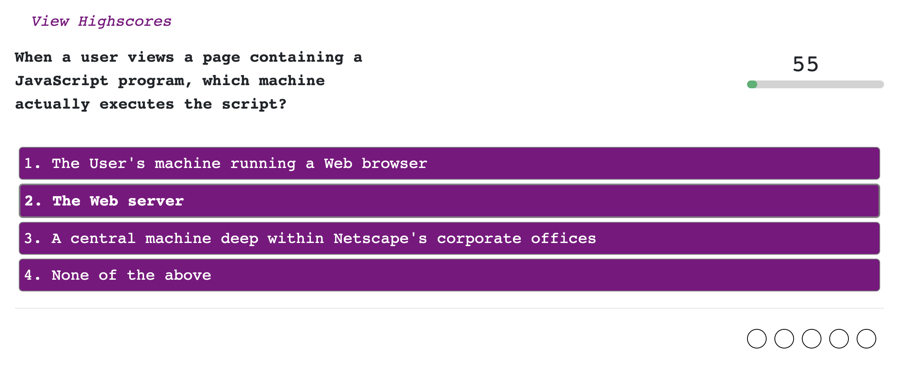

# Code-Quiz

## Description
    The code quiz renders a combination of multiple-choice questions and interactive challenges. 
    It is a timed code quiz with multiple-choice questions. This app runs in the browser and 
    features dynamically updated HTML and CSS powered by JavaScript code. It features a clean 
    and polished user interface and be responsive, ensuring that it adapts to multiple screen sizes.

## Link to Application
The code quiz is currently hosted by GitPages from a GitHub repository.

[Click here to see the deployed application!]()

## Usuage
* 
* 

The following image shows the web application's apperance and functionality:

